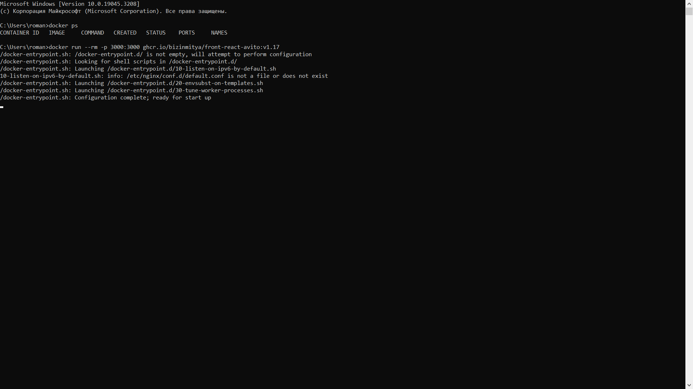

# ***Проект TradeBrainCell***

TradeBrainCell - это проект торговой площадки.На нем люди могут продавать и покупать вещи,оставлять комментарии и делиться своим мнением о продавцах

## ***Установка***

1. Скопируйте репозиторий с [GitHub](https://github.com/RickerX/TradeBrainCell).
2. Установите [Docker](https://www.docker.com/).
3. Загрузите зависимости.

### ***Запуск***

1. Запуск проекта в IntelliJ IDEA.
2. Запуск Docker через командную строку.
3. Ввести в командную строку ```docker ps```,а потом <br/> ```docker run --rm -p 3000:3000 ghcr.io/bizinmitya/front-react-avito:v1.17```.
4. 
5. После этого зайти в браузер и ввести адрес ```localhost:3000```.
6. 
7. Проект запущен

#### ***Возможности пользователей***

1. Анонимный пользователь может:
   <br/>1.1 получать список объявлений.
2. Авторизованный пользователь может:
   <br/>2.1 получать список объявлений.
   <br/>2.2 получать одно объявление.
   <br/>2.3 создавать объявление
   <br/>2.4 редактировать или удалять свое объявление.
   <br/>2.5 получать список комментариев.
   <br/>2.6 создавать комментарии.
   <br/>2.7 редактировать или удалять свои комментарии.
3. Администратор может:
   <br/>1.1 редактировать обявления,комментарии или удалять объявления и комментарии других пользователей

##### ***Разработчики*** 
Оксана - kozyarik82
<br/>Роман - RickerX
